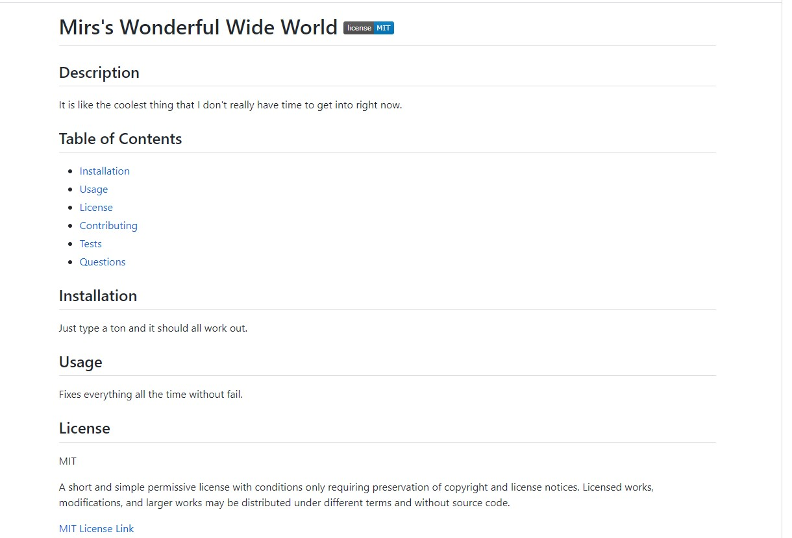

# README Generator

## Description

This is my seventh challenge for the UofU bootcamp. In it you will find a README Generator that asks you a series of questions in the terminal and then generates a README based on your reponses.

## Table of Contents

- [What I Learned](#what-i-learned)
- [Installation](#installation)
- [Usage](#usage)
- [Tests](#tests)

## What I Learned

This go around we learned about node and how it interacts with things liek inquirer. As my fifth JavaScript project I found this to still be a challenge. The biggest issue this go around was getting my head around all this new node stuff and getting my new work enviourment set up. Not having dev tools to help me understand things was also a bit of a transition. As always I will keep pushing forward in an attempt to grow and improve.

## Installation

Go into your terminal in the develop folder and type npm install inquirer. This will get you the files needed to load the questions.

## Usage

Use this to create a README for your projects.

## Tests

Navigate to the develop folder in the terminal and type node index to launch the program. Here is a <a href="https://watch.screencastify.com/v/uCn6jLgeusmXbaPJAOrq">video of the README Generator in action.</a>
